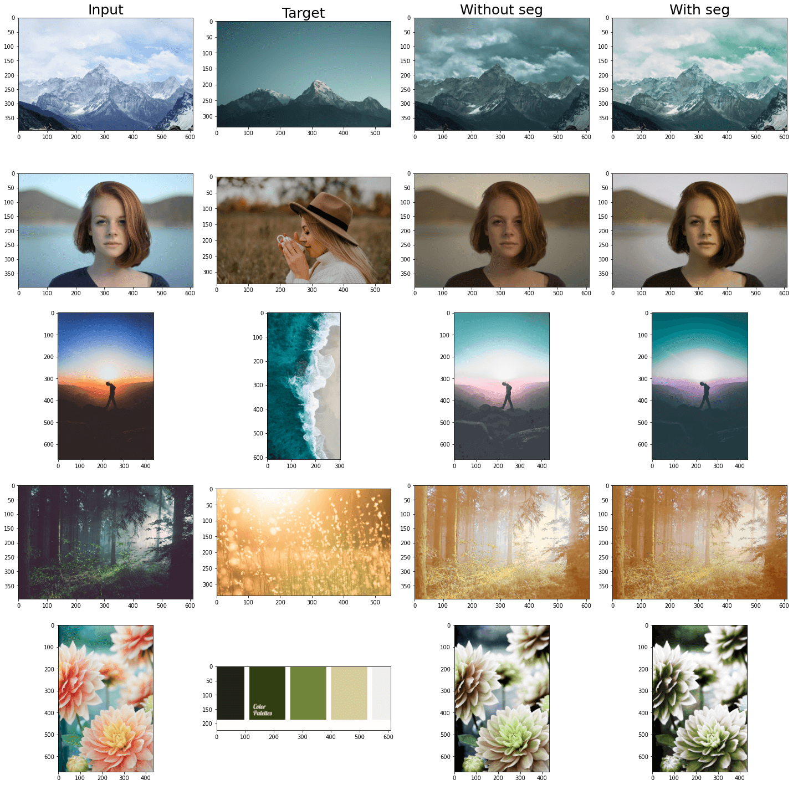



## Conceptual Review

The authors of ***Deep Color Transfer Using Histogram Analogy***[[1]]() proposed a deep learning framework that leverages color histogram analogy for color transfer between source and reference images. The framework consists of two networks, a Histogram Encoding Network (HEN) and a Color Transfer Network (CTN) (Fig. 1). HEN extracts encoded information from the histograms of source and reference images, which is fed into CTN to guide the color transfer process. Although a histogram is a simple and global representation of image colors, convolutional neural networks with encoded histograms can conditionally transfer the colors of reference images to source images. For strongly relevant and irrelevant cases, the same histogram information is used for all parts of the source image, and this is the default setting. When semantic object information is important, as in the case of weak relevance, semantic image segmentation is used and the histogram analogy is extracted and applied for corresponding semantic regions between source and reference images.

## Implementation Details

As the authors did in [[1]](), we’ll train our model on a paired dataset constructed from the MIT-Adobe 5K dataset[[2]]() which consists of five sets, each of which contains 5,000 images. Since using the dataset only provides image pairs with a fixed number of combinations, we also follow the authors to perform color augmentation by transforming the average hue and saturation of the original images to produce more diverse image pairs. In addition, as an ideally trained model must produce the output image the same as the source image if the histograms of the two images are the same, we used identical source and reference image pairs to stabilize the network output. We implement our network on Pytorch. We use the Adam optimizer with the fixed learning rate \\(5*10^{-5}\\), \\(\beta_1=0.5\\), and
 \\(\beta_2=0.999\\). As we jointly train HEN and CTN, the objective function is \\(L_{total} = L_{image} + \lambda_1 L_{hist} + \lambda_2 L_{multi}\\), where \\(L_{image}\\), \\(L_{hist}\\) and \\(L_{multi}\\) are a image loss, a histogram loss, and a multi-scale loss. We used \\(\lambda_1=1.5\\) and \\(\lambda_2=0.5\\). We train the network for 100 epochs.

## Findings

As the image semantic segmentation map may have a huge impact on the final output of our model, we tried several segmentaion models and finalized BEiT v2[[3]]() as our segmentation model. We built the model and loaded downloaded pre-trained weights and then generated the segmentation maps. As shown in Fig 2, the segmentation result from BEiT v2 is quite accurate.

With accurate segmentation maps generated, we tested 4 sets of image pairs and the result is showed in Fig 3. When the reference image and input image have similar semantic content, the model can generate a great color transfer without being fed with segmentation maps. However, when there's a huge content difference, segmentation maps can help improve the model performance (see row 3). The model works well even when the reference image is just a color palette.

## Plans

The experiment we did above meets our expection. In the next few weeks, we'll try to change the structure of our current model and see if better results can be generated. The size of our model is relatively large right now, we'll also try some knowledge distillation techniques and smaller model structure like MobileNet.

---

##### [1] Lee, Junyong, et al. "Deep color transfer using histogram analogy." The Visual Computer 36.10 (2020): 2129-2143. {#ref1}

##### [2] Bychkovsky, Vladimir, et al. "Learning photographic global tonal adjustment with a database of input/output image pairs." CVPR 2011. IEEE, 2011. {#ref2}

##### [3] Peng, Zhiliang, et al. "Beit v2: Masked image modeling with vector-quantized visual tokenizers." arXiv preprint arXiv:2208.06366 (2022). {#ref3}