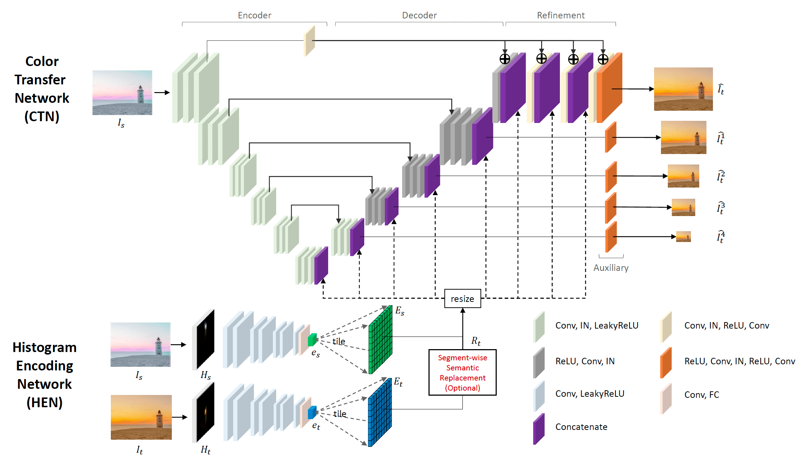
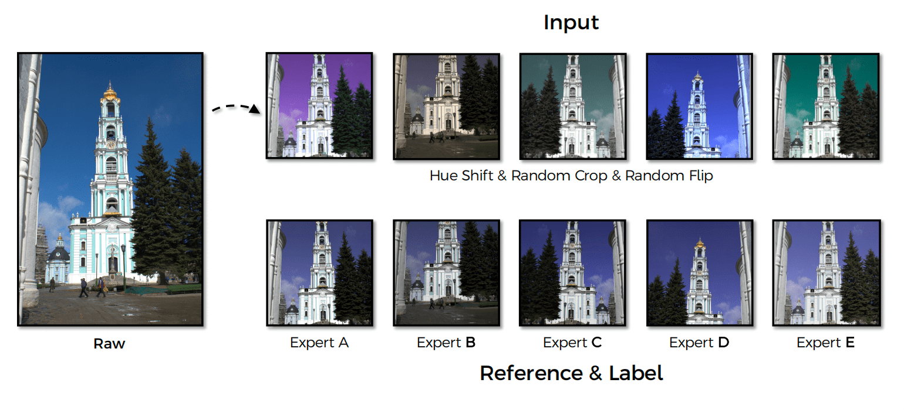
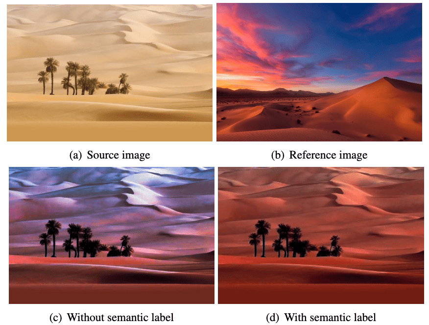
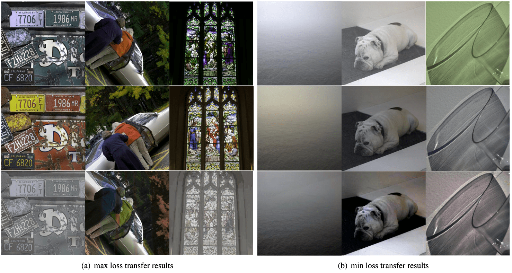



Deep color transfer is an approach to extracting the histogram containing color information from the source and the reference image, then transferring the color between the image pair based on the histogram using a deep neural network. Besides the source image and reference image, semantic segmentation results of both images are optional inputs that can help produce a more precise color transfer.
The method we adopted was published in 2020. Even though it can produce excellent color transfer effects, the size of the model is too large and models that can produce more precise semantic segmentation results have been proposed. We used BEiT v2 to generate more precise semantic segmentation results and a Color Transfer Network with fewer parameters to improve model efficiency. We leveraged knowledge distillation in training the new Color Transfer Network. Experimental results showed that our method could generate satisfying color transfer effects faster and support larger input images.

## 1. Introduction

Color is the most direct visual perception of an image and the central consideration when people edit their photographs. Color filters are commonly seen in the applications such as Instagram and TikTok. Color transfer in our project refers to adequately transferring the reference image's color to the source image while keeping the objects in the source images unchanged.

Our main contributions are summarized as follows:

- Introduced BEiT v2[[1]]() to the histogram encode network and a Color Transfer Network with fewer parameters.
- Applied knowledge distillation[[2]]() during the training of the smaller model, significantly reducing the time of training and enabling the model to produce similar color transfer effects to the original model while increasing the inference speed and maximum resolution of input images.

## 2. Related work

***Color transfer***
    The Color transfer method is constantly evolving. The conventional approaches try to match the means and standard deviations of the source to reference images or calculate probability density functions. Other solutions are also based on the local color part, including the EM algorithm and neural representations. Lee et al. [[3]]() adopted the idea from photorealistic image style transfer[[4]]() and introduced neural network to color transfer.

***Semantic segmentation***
BEiT v2[[1]]() is the latest SOTA mask modeling method published in 2022. It proposed the VQ-KD(vector-quantized knowledge distillation) method, which discretizes a continuous semantic space that supervises masked image modeling rather than relying on image pixels. This approach highly promoted the accuracy of semantic segmentation compared. The previous method that the author used addressed semantic segmentation by incorporating high-order relations
and mixture of label contexts into MRF. They solved MRF by proposing a Convolutional Neural Network, which enables deterministic end-to-end computation in a single forward pass.

***Knowledge distillation***
Knowledge distillation[[2]]() refers to transferring knowledge from a large, heavy model to a smaller model that can be practically deployed under real-world constraints. In other words, a small "student" model learns to mimic a "teacher" model and leverage the teacher's knowledge to obtain similar or even higher accuracy.

## 3. Methodology

### 3.1 Framework

Our framework kept the basic ideas of the Histogram Encoding Network(HEN) and Color Transfer Network(CTN) from [[3]](). HEN is a convolutional neural network that includes eight convolution layers and eight subsequent leaky ReLU activation of each layer. CTN is composed of a U-Net to encode and decode input images and a refinement module to process the decoding result and generate the output image.

Input image \\(I_s\\) and reference image \\(I_t\\) will be converted to LAB color space first. Histograms \\(H^l\\) for L space and \\(H^{ab}\\) for ab space of each image will then be calculated. \\(H^l\\) and \\(H^{ab}\\) will be tiled and then concatenated together as \\(H\\). The HEN will encode \\(H_s\\) and \\(H_t\\) as feature vectors \\(e_s\\) and \\(e_t\\). To fuse spatial feature maps of \\(I_s\\) and 1D global feature vectors \\(e_s\\) and \\(e_t\\), we tile the feature vectors to form histogram feature maps \\(e_s\\) and \\(e_t\\) with the spatial size of the corresponding decoding layer in the CTN to be concatenated.

Semantic segmentation results are optional inputs of this framework. We first compute local histograms from image regions with the same semantic labels and then feed the semantic-wise histograms into HEN to construct a spatially and semantically varying histogram feature map \\(R_t\\) instead of the global map \\(e_t\\). By doing this, CTN can receive more precise local information of the reference histogram, increasing the certainty in determining colors when the source and the reference image have different spatial compositions.

### 3.2 Loss function

As the authors did in [[3]](), three types of losses are used to evaluate model performance and help with model training. Image loss \\( L_{image} \\) is the mean-squared error between the color transfer result \\(\hat{I_t}\\) and the ground-truth image \\(I_t\\).
To enforce the color transfer result \\(\hat{I_t}\\) to have a similar histogram with the reference image, histogram loss \\(L_{hist} = MSE(\hat{H_t}, H_t)\\) is introduced.
The role of each decoder layer in CTN is to up-sample information from the previous layer, we use multi-scale loss \\(L_{multi}\\) to enforce this role. It's defined by \\(L_{multi} = \frac{1}{D}\sum_{d=1}^D MSE(\hat{I}^d_t,I_t^d)\\), where \\(D\\) is the number of layers of the decoder.

These losses are combined with weights \\( \lambda_1 \\) and \\( \lambda_2 \\):

$$
L_{hard} = L_{image} + \lambda_1 * L_{hist} +\lambda_2 * L_{multi}
$$

For knowledge distillation, we redesigned the loss to include the distance between the teacher, the pre-trained model using the methods in [[3]](), and the student, our redesigned model with fewer parameters. The distillation loss is quite similar to the original loss, but we switched the ground-truth image \\(I_t\\) to the output of the teacher model.

The loss of the student model is a combination of the hard loss and the soft loss:

$$
L = \alpha * L_{soft} + (1-\alpha) * L_{hard}
$$

## 4. Experiments

### 4.1 Training

#### 4.1.1 Dataset construction

The dataset we used is called MIT-Adobe 5K[[5]](), which comprises the raw set of 5000 images and five same-size retouched subsets from five different experts. This dataset is excellent for our task as the source-reference images here are almost the same except for color. This would accommodate the network to learn the histogram features easily and transfer color naturally. To initiate more possible combinations of image pairs, we performed color augmentation which transfers the average hue and saturation of the source image as the authors did in [[3]](). Besides color augmentation, we also adopted normal image augmentation methods like random crop and horizontal flip.

#### 4.1.2 Implementation details
The whole network is built with the PyTorch framework, and we used 8 NVIDIA A40 GPUs to train our models. As the author only published low-performance code for model construction and testing, we built a scalable framework that supports multiple-GPU parallel training and backbone switching from scratch. Bin size when calculating histograms are \\( B_{ab}=64 \\), \\(B_{l}=8\\). We used Adam[[6]]() as the optimizer with a learning rate of \\(5*10^{-5}\\), \\(\beta_1 = 0.5\\), \\(\beta_2 = 0.999\\). The weights of different losses are \\(\lambda_1 = 10\\), \\(\lambda_2 = 10\\), \\(\alpha = 0.5\\).

### 4.2 Evaluation

The loss curves of the training process using knowledge distillation are shown in figure 4 and 5. Blue lines are the loss of the student model while pink dashed lines indicate the loss of the teacher model, which can be seen as the ultimate goal of the student model. As shown in the loss curves, it only took 25 epochs for the student model to converge, which is much faster compared with the 115 epochs the teacher model took. The student model can produce similar color transfer effects to the teacher model with slightly higher image losses and unexpected lower histogram loss.

## 5. Results

### 5.1 Test case analysis
We selected images of different categories for the test dataset, including portrait, animal, mountain, building, desert, and abstract paintings. We can get image pairs with different levels of content relevance from permutations of these images. Figures 8, 9, and 10 are examples of the color transfer results of different image pairs. 

For strong relevance image pairs with almost identical structure and contents, figure 6 shows that the color of the sky, trees, plants, sofa, and decorations in source and reference images are matched and transferred perfectly. 

Weak relevance image pairs are those from the same categories with similar contents. For example, the images displayed in figure 7 all contain "desert" or "building". However, the positions of semantic objects have less similarity than the strong ones. The output images indicate that the colors are transferred to the source images appreciably and naturally.

Figure 8 shows the color transfer results between irrelevance image pairs, where the input images' content does not correlate. The two images of the first example in figure 8 are abstract digital paintings and have complex graphical shapes. The output demonstrates that our network could learn the histogram feature and transfer the primary color excellently.

Besides image pairs with different content correlations, we also compared the network's output with and without using semantic labels. The image in the bottom right corner of figure 9 is the model output without using the semantic label. It does not truly reflect all the colors contrasting with the one using the label on the left, indicating that semantic labels of the input images can help our model produce more precise color transfer results between semantically similar objects.

### 5.2 Loss analysis

We calculated the hard loss of each image pair in the training dataset, and color transfer results of the top three images with the largest and smallest loss are shown in figure 10. Each column in figure 10 represents one data point. The source, reference, and output images are in the first, second, and third rows respectively.

Our findings are listed below:

- Images with larger losses have more complex compositions than small ones, which means the features and colors are more challenging to be learned and transferred. Also, the semantic segmentation labels here are not precise enough to distinguish the tiny areas.

- Our network is sensitive to the angle of an image. The source image is horizontally flipped in the second column, and the people's clothing and tree colors are misconverted.

- The fewer different colors in the image pair, the better outcome could be produced. The three columns on the right show that image pairs with the smallest loss only contain one to two different colors.

## 6. Summary

In this project, we built a deep-learning-based model for color transfer between images. We adopted the idea from [[3]]() and utilized knowledge distillation to get a smaller model with similar performance to the original one, significantly reducing the training time and increasing the maximum supported input resolution. For image pairs with similar semantic objects but different compositions, we switched to BEiT v2 for generating semantic labels and greatly improved the color transfer accuracy.

Our model can produce excellent color transfer results for image pairs with different levels of content relevance. However, although we applied the SOTA segmentation model, the semantic labels are still not accurate enough when the contents are complex, leading to unsatisfying results. The general model without using semantic labels got more natural results in these cases.

In the future, encoder and decoder in the Color Transfer Network with different structures, e.g. transformers, can be tried. The structure of the Color Transfer Network can also be redesigned to support high-resolution input and output better.

## 7. Statement of contributions

**Weipeng Zhang:** code, dataset preparation, model training, presentation, report.

**Yubing Gou:** dataset preparation, model testing and analysis, report.

---

##### [1] Zhiliang Peng, Li Dong, Hangbo Bao, Qixiang Ye, and Furu Wei. ***Beit v2: Masked image modeling with vector-quantized visual tokenizers.*** arXiv preprint arXiv:2208.06366, 2022.  {#ref1}

##### [2] Geoffrey Hinton, Oriol Vinyals, Jeff Dean, et al. ***Distilling the knowledge in a neural network.*** arXiv preprint arXiv:1503.02531, 2(7), 2015. {#ref2}

##### [3] Junyong Lee, Hyeongseok Son, Gunhee Lee, Jonghyeop Lee, Sunghyun Cho, and Seungyong Lee. ***Deep color transfer using histogram analogy.*** The Visual Computer, 36(10):2129–2143, 2020.  {#ref3}

##### [4] Fujun Luan, Sylvain Paris, Eli Shechtman, and Kavita Bala. ***Deep photo style transfer.*** In Proceedings of the IEEE conference on computer vision and pattern recognition, pages 4990–4998, 2017. {#ref4}

##### [5] Vladimir Bychkovsky, Sylvain Paris, Eric Chan, and Fr ́edo Durand. ***Learning photographic global tonal adjustment with a database of input / output image pairs.*** In The Twenty-Fourth IEEE Conference on Computer Vision and Pattern Recognition, 2011. {#ref5}

##### [6] Diederik P Kingma and Jimmy Ba. ***Adam: A method for stochastic optimization.*** arXiv preprint arXiv:1412.6980, 2014. {#ref6}
